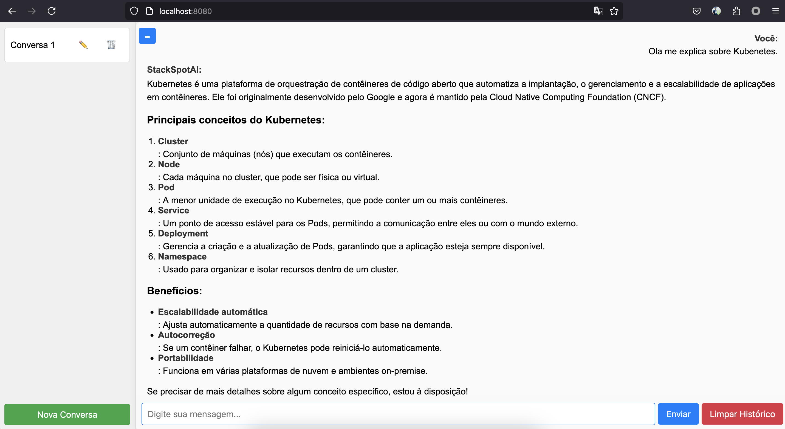
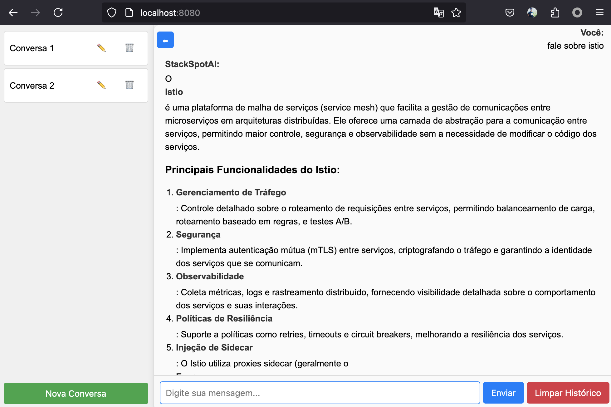
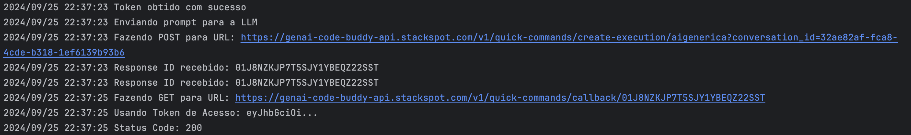

# Aplicativo de Chat com Integração à StackSpot AI e OpenAI

Bem-vindo ao aplicativo de chat interativo semelhante ao ChatGPT, mas integrado à **StackSpot AI** e aos modelos GPT da **OpenAI**. Este aplicativo permite que você se comunique com uma inteligência artificial em um ambiente web amigável, aproveitando os poderosos recursos fornecidos pela StackSpot AI e pela OpenAI, incluindo fontes de conhecimento, comandos rápidos, agentes especializados e conversas com manutenção de contexto.

## Sumário

- [Funcionalidades](#funcionalidades)
- [Pré-requisitos](#pré-requisitos)
- [Instalação e Configuração](#instalação-e-configuração)
- [Uso](#uso)
- [Integração com a StackSpot AI e OpenAI](#integração-com-a-stackspot-ai-e-openai)
    - [Provedores de LLM](#provedores-de-llm)
    - [Fontes de Conhecimento (StackSpot AI)](#fontes-de-conhecimento-stackspot-ai)
    - [Comandos Rápidos (StackSpot AI)](#comandos-rápidos-stackspot-ai)
    - [Agentes Especializados (StackSpot AI)](#agentes-especializados-stackspot-ai)
    - [Manutenção de Contexto (OpenAI)](#manutenção-de-contexto-openai)
- [Detalhes Técnicos](#detalhes-técnicos)
- [Resolução de Problemas](#resolução-de-problemas)
- [Contribuição](#contribuição)
- [Licença](#licença)
- [Agradecimentos](#agradecimentos)
- [Screenshots](#screenshots)
- [Referências](#referências)

## Funcionalidades

- **Chat Interativo:** Converse com uma inteligência artificial em tempo real, alimentada pela StackSpot AI ou pela OpenAI.
- **Múltiplas Conversas:** Crie, renomeie e exclua chats independentes.
- **Manutenção de Contexto:** O assistente de IA mantém o contexto da conversa para interações mais coerentes (ao usar OpenAI).
- **Barra Lateral Personalizável:** Oculte ou exiba a barra lateral conforme sua preferência.
- **Histórico de Mensagens:** O histórico é armazenado no `localStorage` do navegador.
- **Suporte a Markdown:** Envie e receba mensagens formatadas em Markdown, com realce de sintaxe para código.
- **Indicador de Carregamento:** Enquanto a IA processa sua mensagem, um indicador "Pensando..." é exibido.
- **Interface Responsiva:** Design adaptável para diversos tamanhos de tela.
- **Segurança Integrada:** Sanitização de conteúdo para prevenir execução de código malicioso.
- **Seleção Dinâmica de Provedor de LLM:** Escolha entre StackSpot AI e OpenAI como o provedor de modelo de linguagem via variáveis de ambiente.
- **Seleção de Modelo (OpenAI):** Configure o aplicativo para usar diferentes modelos da OpenAI, como `gpt-3.5-turbo` ou `gpt-4`.

## Pré-requisitos

- **Go:** Versão 1.20+ instalada em sua máquina.
- **Navegador Moderno:** Google Chrome, Mozilla Firefox, Microsoft Edge ou equivalente.
- **Acesso a Provedores de LLM:**
    - **Para StackSpot AI:**
        - Conta com acesso às APIs da StackSpot AI.
        - `CLIENT_ID`, `CLIENT_SECRET` e `SLUG_NAME` para autenticação e acesso à API.
    - **Para OpenAI:**
        - Chave de API da OpenAI com acesso aos modelos desejados (por exemplo, `gpt-3.5-turbo`, `gpt-4`).
        - Observe que o acesso ao `gpt-4` pode exigir permissões adicionais.
- **Chaves de API:** Chaves de API e variáveis de ambiente configuradas corretamente para o provedor de LLM selecionado.

## Instalação e Configuração

### 1. Clone o Repositório

```bash
git clone https://github.com/diillson/chatcomStackspotAI.git
```

### 2. Navegue até o Diretório do Projeto

```bash
cd chatcomStackspotAI/
```

### 3. Configurar Variáveis de Ambiente

Dependendo do provedor de LLM que você deseja usar, defina as variáveis de ambiente apropriadas.

#### Para StackSpot AI:

- **LLM_PROVIDER:** Defina como `STACKSPOT`.
- **CLIENT_ID:** Seu `client_id` da StackSpot AI.
- **CLIENT_SECRET:** Seu `client_secret` da StackSpot AI.
- **SLUG_NAME:** O slug do seu Quick Command ou agente.

Exemplo:

```bash
export LLM_PROVIDER=STACKSPOT
export CLIENT_ID=seu_client_id
export CLIENT_SECRET=seu_client_secret
export SLUG_NAME=seu_slug_name
```

**Nota:** Certifique-se de que o `tokenURL` na função `refreshToken` aponta para o tenant correto, por exemplo, `https://idm.stackspot.com/zup/oidc/oauth/token`, onde `zup` é o tenant.

#### Para OpenAI:

- **LLM_PROVIDER:** Defina como `OPENAI`.
- **OPENAI_API_KEY:** Sua chave de API da OpenAI.
- **OPENAI_MODEL:** O modelo que você deseja usar (`gpt-3.5-turbo`, `gpt-4`, etc.).

Exemplo:

```bash
export LLM_PROVIDER=OPENAI
export OPENAI_API_KEY=sua_chave_api_openai
export OPENAI_MODEL=gpt-4  # ou gpt-3.5-turbo
```

**Nota:** Certifique-se de que sua chave de API da OpenAI tem acesso ao modelo especificado.

### 4. Instale as Dependências Backend

```bash
go mod tidy
```

### 5. Execute o Servidor Backend

```bash
go run main.go
```

O servidor iniciará na porta `8080` por padrão.

### 6. Acesse o Aplicativo no Navegador

Abra o navegador e visite:

```
http://localhost:8080
```

## Uso

### Criar Nova Conversa

- Clique no botão **"Nova Conversa"** na barra lateral para iniciar um novo chat.
- A conversa será adicionada à lista na barra lateral.

### Enviar Mensagens

- Digite sua mensagem no campo de entrada na parte inferior.
- Pressione **"Enviar"** ou aperte **Enter** para enviar a mensagem.
- Aguarde a resposta da IA, que é fornecida pela StackSpot AI ou pela OpenAI, dependendo de sua configuração.
- O aplicativo mantém o contexto da conversa ao usar a OpenAI, permitindo interações mais coerentes.

### Alternar Entre Conversas

- Na barra lateral, clique no nome da conversa para alternar entre chats.
- Cada conversa mantém seu próprio histórico de mensagens.

### Renomear Conversas

- Clique no ícone de **lápis (✏️)** ao lado do nome da conversa na barra lateral.
- Insira o novo nome e confirme.

### Deletar Conversas

- Clique no ícone de **lixeira (🗑️)** ao lado do nome da conversa.
- Confirme a exclusão na janela que aparecerá.
- **Atenção:** Esta ação é irreversível e o histórico será perdido.

### Ocultar/Exibir Barra Lateral

- Use o botão de alternância **(⬅/➡)** no canto superior esquerdo para ocultar ou exibir a barra lateral.
- Isto é útil para maximizar a área de visualização do chat.

### Limpar Histórico

- Dentro de uma conversa, clique no botão **"Limpar Histórico"** para apagar todas as mensagens daquela conversa.

## Integração com a StackSpot AI e OpenAI

Este aplicativo depende fortemente das APIs fornecidas pela **StackSpot AI** e pela **OpenAI**. Ele permite que você escolha entre esses provedores, oferecendo flexibilidade e acesso a diferentes recursos e modelos.

### Provedores de LLM

Você pode selecionar o provedor de Modelo de Linguagem (LLM) via variável de ambiente `LLM_PROVIDER`. O aplicativo suporta:

- **StackSpot AI:** Fornece acesso a fontes de conhecimento, comandos rápidos e agentes especializados.
- **OpenAI:** Oferece acesso a modelos como `gpt-3.5-turbo` e `gpt-4`, com capacidade de manter o contexto da conversa.

### Fontes de Conhecimento (StackSpot AI)

- **O que são:** Fontes de conhecimento personalizadas que permitem à IA acessar informações específicas e relevantes.
- **Uso no Aplicativo:** As fontes de conhecimento enriquecem as respostas da IA, garantindo que sejam precisas e contextualizadas.
- **Configuração:** Configuradas na plataforma StackSpot AI e podem incluir documentos, artigos, bases de dados internas, entre outros.

### Comandos Rápidos (StackSpot AI)

- **O que são:** Comandos pré-configurados que permitem executar tarefas ou obter informações rapidamente através da IA.
- **Uso no Aplicativo:** O aplicativo utiliza comandos rápidos para processar certos tipos de solicitações de maneira eficiente, como executar ações específicas ou obter respostas padronizadas.
- **Exemplos de Comandos:**
    - `explain-code`: Solicita à IA que explique um trecho de código fornecido.
    - Comandos personalizados: Você pode criar seus próprios comandos rápidos na StackSpot AI e usá-los via a variável de ambiente `SLUG_NAME`.

### Agentes Especializados (StackSpot AI)

- **O que são:** Agentes de IA personalizados que são treinados para realizar tarefas específicas ou atuar em determinados domínios.
- **Uso no Aplicativo:** O aplicativo pode direcionar mensagens para agentes especializados conforme o contexto da conversa, melhorando a qualidade e a relevância das respostas.
- **Criação de Agentes:** Agentes podem ser criados na plataforma StackSpot AI, configurando seus comportamentos e fontes de conhecimento.

### Manutenção de Contexto (OpenAI)

- **O que é:** A capacidade da IA de lembrar mensagens anteriores na conversa e fornecer respostas coerentes.
- **Uso no Aplicativo:** Ao usar a OpenAI como provedor de LLM, o aplicativo envia o histórico completo da conversa para a API, permitindo que a IA mantenha o contexto.
- **Configuração:** Certifique-se de que a variável de ambiente `OPENAI_MODEL` está definida para um modelo que suporta contexto, como `gpt-3.5-turbo` ou `gpt-4`.

### Importância dos Provedores de LLM

- **Processamento de Linguagem:** Tanto a StackSpot AI quanto a OpenAI fornecem modelos de linguagem avançados que processam e geram as respostas no chat.
- **APIs Robustas:** As APIs permitem uma integração fácil e segura com o aplicativo, garantindo desempenho e confiabilidade.
- **Personalização:** Com fontes de conhecimento, comandos rápidos e agentes (StackSpot AI), ou com seleção de modelos e manutenção de contexto (OpenAI), é possível personalizar profundamente o comportamento da IA para atender às necessidades específicas dos usuários.
- **Sem os Provedores de LLM:** O aplicativo não seria capaz de fornecer respostas inteligentes e contextualizadas, pois depende totalmente dos serviços do provedor selecionado.

## Detalhes Técnicos

### Arquitetura

- **Design Modular:** O aplicativo segue uma estrutura modular, permitindo a adição fácil de novos backends de LLM no futuro.
- **Interface LLMClient:** Define o contrato que todas as implementações de LLM devem seguir, permitindo uma maneira consistente de interagir com diferentes provedores.
- **Manutenção de Contexto:** O aplicativo mantém o contexto da conversa ao usar a OpenAI, enviando o histórico completo da conversa a cada solicitação.

### Frontend

- **HTML5 e CSS3:** Estrutura semântica e estilos responsivos.
- **JavaScript (ES6+):** Manipulação do DOM e lógica do aplicativo.
- **Bibliotecas Utilizadas:**
    - **Marked.js:** Renderização de Markdown para HTML.
    - **DOMPurify:** Sanitização do HTML gerado para evitar ataques XSS.
    - **Highlight.js:** Realce de sintaxe em trechos de código.

### Backend

- **Go (`main.go`):** Servidor HTTP que lida com as requisições do frontend e se comunica com o provedor de LLM.
- **Integração com Provedores de LLM:**
    - **Autenticação:** Utiliza as chaves de API configuradas para autenticação.
    - **Manipulação de Requisições:** Structs e métodos definidos para serializar e deserializar dados JSON trocados com as APIs.
    - **Rotas Implementadas:**
        - **`/send`:** Endpoint POST que recebe mensagens do frontend, encaminha para o provedor de LLM e retorna a resposta.
- **Concorrência e Tratamento de Erros:** Manipulação adequada de requisições HTTP, timeouts e relatórios de erros para garantir um aplicativo robusto.

### Armazenamento

- **`localStorage`:** Utilizado para armazenar o histórico de conversas e o estado atual do aplicativo no navegador do usuário.

## Resolução de Problemas

### Falha na Autenticação com o Provedor de LLM

- **Sintomas:** Recebe erros de autenticação ao tentar se comunicar com a API.
- **Soluções:**
    - Verifique se as chaves de API (`CLIENT_ID`, `CLIENT_SECRET`, `OPENAI_API_KEY`) estão configuradas corretamente.
    - Certifique-se de que as variáveis de ambiente estão definidas e acessíveis para o aplicativo.
    - Confirme se as chaves de API têm as permissões necessárias para acessar os serviços utilizados.
    - Para StackSpot AI, certifique-se de que a URL de token e o tenant estão corretamente configurados na função `refreshToken`.
    - Para OpenAI, certifique-se de que sua conta tem acesso ao modelo especificado (por exemplo, o `gpt-4` pode exigir permissões especiais).

### Contexto Não Mantido nas Conversas

- **Sintomas:** A IA não lembra mensagens anteriores e trata cada mensagem de forma independente.
- **Soluções:**
    - Certifique-se de que o aplicativo está enviando corretamente o histórico da conversa para o provedor de LLM.
    - Para OpenAI, verifique se o método `SendPrompt` inclui o parâmetro `history` e se a requisição à API inclui o histórico completo da conversa.
    - Confirme que você está usando um modelo da OpenAI que suporta contexto (por exemplo, `gpt-3.5-turbo`, `gpt-4`).

### Comandos Rápidos ou Agentes Não Funcionam (StackSpot AI)

- **Sintomas:** As respostas da IA não correspondem aos comandos ou agentes esperados.
- **Soluções:**
    - Certifique-se de que os comandos rápidos e agentes estão configurados corretamente na plataforma StackSpot AI.
    - Verifique se o aplicativo está enviando o `SLUG_NAME` correto e se ele corresponde ao comando rápido ou agente configurado.
    - Consulte a documentação da StackSpot AI para detalhes sobre como utilizar comandos rápidos e agentes.

### Outros Problemas Relacionados à Interface

- **Sintomas:** Problemas com a interface do usuário, como mensagens não sendo exibidas corretamente.
- **Soluções:**
    - Certifique-se de que todas as dependências do frontend estão sendo carregadas corretamente.
    - Verifique o console do navegador em busca de erros JavaScript.
    - Confirme se o servidor está em execução e acessível.

## Contribuição

Contribuições são bem-vindas! Para contribuir:

1. **Faça um Fork** do repositório.
2. Crie uma **branch** para sua feature ou correção:

   ```bash
   git checkout -b minha-feature
   ```

3. **Commit** suas alterações:

   ```bash
   git commit -m 'Adiciona nova funcionalidade'
   ```

4. **Push** para a branch:

   ```bash
   git push origin minha-feature
   ```

5. Abra um **Pull Request** no GitHub.

## Licença

Este projeto é licenciado sob a licença MIT - veja o arquivo [LICENSE](LICENSE) para mais detalhes.

---

Esperamos que este aplicativo proporcione uma experiência enriquecedora de interação com a inteligência artificial, aproveitando os poderosos recursos da **StackSpot AI** e da **OpenAI**. Se você tiver dúvidas ou encontrar problemas, não hesite em abrir uma issue ou entrar em contato.

**Divirta-se e boas conversas!**

---

## Agradecimentos

Agradecemos à **StackSpot AI** e à **OpenAI** por fornecerem as ferramentas e APIs que tornam este aplicativo possível. Suas plataformas robustas e flexíveis permitem criar soluções inovadoras de inteligência artificial de forma acessível e eficiente.

---

## Screenshots

### Chat com StackSpot AI



### Chat com OpenAI GPT-4



### Logs do Backend



---

## Referências

- **Documentação da StackSpot AI:**
    - [StackSpot AI - Visão Geral](https://ai.stackspot.com/docs)
    - [Fontes de Conhecimento](https://ai.stackspot.com/docs/pt-br/knowledge-source/ks)
    - [Agentes Especializados](https://ai.stackspot.com/docs/pt-br/agents/create-agents)
    - [Comandos Rápidos](https://ai.stackspot.com/docs/pt-br/quick-commands/quick-command)
- **Documentação da OpenAI:**
    - [Referência da API OpenAI](https://platform.openai.com/docs/api-reference/introduction)
    - [API de Conclusão de Chat](https://platform.openai.com/docs/api-reference/chat)
    - [Modelos Disponíveis](https://platform.openai.com/docs/models/overview)

**Nota:** As referências acima são importantes para entender como configurar e utilizar os recursos integrados neste aplicativo.

---