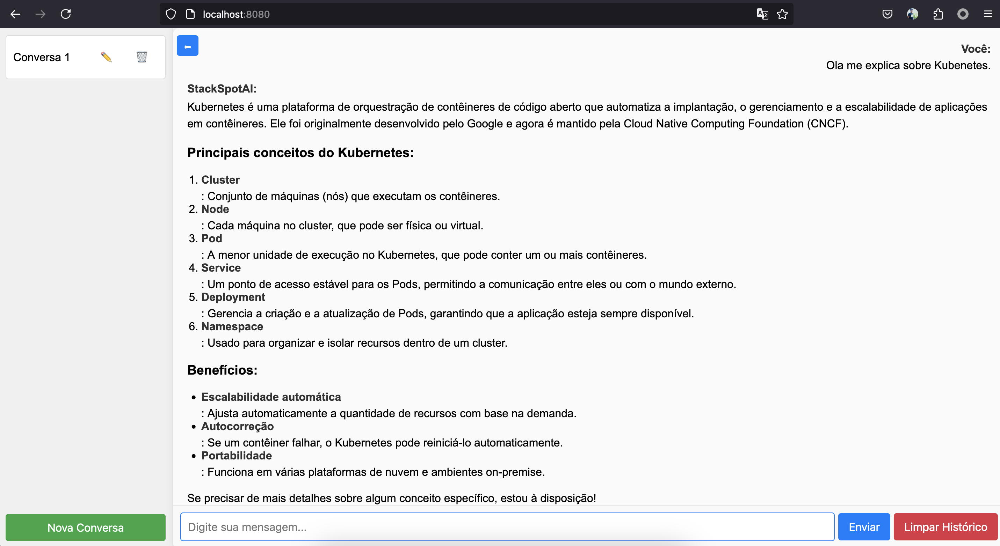
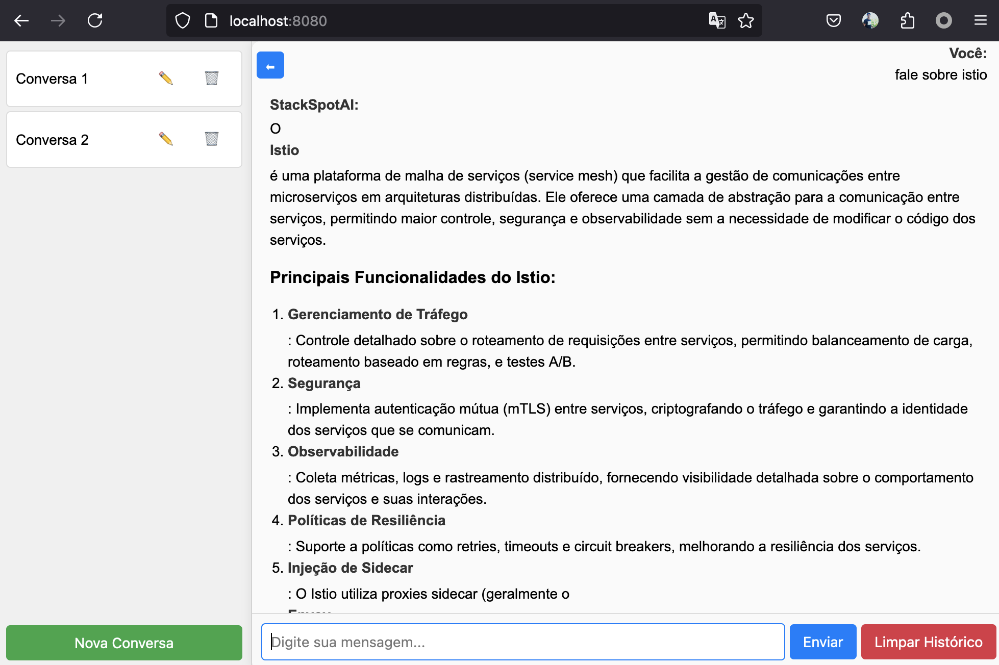
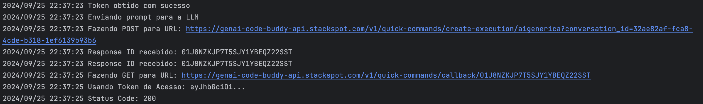

# Aplicativo de Chat com Integração à StackSpot AI

Bem-vindo ao aplicativo de chat interativo como o chatgpt, porém integrado à **StackSpot AI**, uma plataforma poderosa que fornece APIs para interagir com modelos de linguagem avançados, fontes de conhecimento personalizadas, comandos rápidos e agentes especializados. Este aplicativo permite que você se comunique com uma inteligência artificial em um ambiente web amigável, aproveitando ao máximo os recursos fornecidos pela StackSpot AI.

## Sumário

- [Funcionalidades](#funcionalidades)
- [Pré-requisitos](#pré-requisitos)
- [Instalação e Configuração](#instalação-e-configuração)
- [Uso](#uso)
- [Integração com a StackSpot AI](#integração-com-a-stackspot-ai)
    - [Knowledge Sources](#knowledge-sources)
    - [Quick Commands](#quick-commands)
    - [Agentes Especializados](#agentes-especializados)
- [Detalhes Técnicos](#detalhes-técnicos)
- [Resolução de Problemas](#resolução-de-problemas)
- [Contribuição](#contribuição)
- [Licença](#licença)

## Funcionalidades

- **Chat Interativo:** Converse com uma inteligência artificial em tempo real, alimentada pela StackSpot AI.
- **Múltiplas Conversas:** Crie, renomeie e exclua chats independentes.
- **Barra Lateral Personalizável:** Oculte ou exiba a barra lateral conforme sua preferência.
- **Histórico de Mensagens:** O histórico é armazenado no `localStorage` do navegador.
- **Suporte a Markdown:** Envie e receba mensagens formatadas em Markdown, com realce de sintaxe para código.
- **Indicador de Carregamento:** Enquanto a IA processa sua mensagem, um indicador "Pensando..." é exibido.
- **Interface Responsiva:** Design adaptável para diversos tamanhos de tela.
- **Segurança Integrada:** Sanitização de conteúdo para prevenir execução de código malicioso.

## Pré-requisitos

- **Go:** Versão 1.23+ ou superior instalada em sua máquina.
- **Navegador Moderno:** Google Chrome, Mozilla Firefox, Microsoft Edge ou equivalente.
- **Conta na StackSpot AI:** Acesso às APIs da StackSpot AI para utilizar os serviços de LLM, Knowledge Sources, Quick Commands e Agentes.
- **Chaves de API:** Chave de acesso à API da StackSpot AI configurada no backend.

## Instalação e Configuração

1. **Clone o Repositório:**

   ```bash
   git clone https://github.com/diillson/chatcomStackspotAI.git
   ```

2. **Navegue até o Diretório do Projeto:**

   ```bash
   cd chatcomStackspotAI/
   ```

3. **Configurar Variáveis de Ambiente:**

    - **Chave de API da StackSpot AI:** Crie duas variáveis de ambiente esperada pela aplicação `CLIENT_ID` e `CLIENT_SECRET` com sua chave de API da StackspotAI.
    - **Configuração de Endpoint:** Certifique-se de que o endpoint da API da StackSpot AI está configurado corretamente no `main.go` conforme após ter criado seu quickcommand, pois ai está onde a mágica acontece.
    - **Configuração do quickcommand e passagem do SLUG:** Após ter criado no portal da stackspotAI seu quickcommand, anote o slug, Crie a varaiável `SLUG_NAME` coloque sua SLUG como valor para que tudo funcione conforme o esperado.

4. **Instale as Dependências Backend:**

   ```bash
   go mod tidy
   ```

5. **Execute o Servidor Backend:**

   ```bash
   go run main.go
   ```

   O servidor iniciará na porta `8080` por padrão.

6. **Acesse o Aplicativo no Navegador:**

   Abra o navegador e visite:

   ```
   http://localhost:8080
   ```

## Uso

### Criar Nova Conversa

- Clique no botão **"Nova Conversa"** na barra lateral para iniciar um novo chat.
- A conversa será adicionada à lista na barra lateral.

### Enviar Mensagens

- Digite sua mensagem no campo de entrada na parte inferior.
- Pressione **"Enviar"** ou aperte **Enter** para enviar a mensagem.
- Aguarde a resposta da IA, que é fornecida pela StackSpot AI.
- O aplicativo utiliza **Quick Commands** e **Agentes Especializados** para processar suas solicitações.

### Alternar Entre Conversas

- Na barra lateral, clique no nome da conversa para alternar entre chats.
- Cada conversa mantém seu próprio histórico de mensagens.

### Renomear Conversas

- Clique no ícone de **lápis (✏️)** ao lado do nome da conversa na barra lateral.
- Insira o novo nome e confirme.

### Deletar Conversas

- Clique no ícone de **lixeira (🗑️)** ao lado do nome da conversa.
- Confirme a exclusão na janela que aparecerá.
- **Atenção:** Esta ação é irreversível e o histórico será perdido.

### Ocultar/Exibir Barra Lateral

- Use o botão de alternância **(⬅/➡)** no canto superior esquerdo para ocultar ou exibir a barra lateral.
- Isto é útil para maximizar a área de visualização do chat.

### Limpar Histórico

- Dentro de uma conversa, clique no botão **"Limpar Histórico"** para apagar todas as mensagens daquela conversa.

## Integração com a StackSpot AI

Este aplicativo depende fortemente das APIs fornecidas pela **StackSpot AI**. Sem elas, o aplicativo não funcionaria, pois toda a lógica de processamento de linguagem natural é manejada pela plataforma.

### Knowledge Sources

- **O que são:** Fontes de conhecimento personalizadas que permitem à IA acessar informações específicas e relevantes para o contexto desejado.
- **Uso no Aplicativo:** As **Knowledge Sources** são utilizadas para fornecer à IA informações específicas que enriquecem as respostas, garantindo que sejam precisas e contextualizadas.
- **Configuração:** As fontes de conhecimento são configuradas na plataforma StackSpot AI e podem incluir documentos, artigos, bases de dados internas, entre outros.

### Quick Commands

- **O que são:** Comandos pré-configurados que permitem executar tarefas ou obter informações rapidamente através da IA.
- **Uso no Aplicativo:** O aplicativo utiliza **Quick Commands** para processar certos tipos de solicitações de maneira eficiente, como executar ações específicas ou obter respostas padronizadas.
- **Exemplos de Comandos:**
    - `explain-code`: Solicita à IA que explique um trecho de código fornecido.
    - `camadazero`: Um comando personalizado para obter informações sobre um tópico específico.

### Agentes Especializados

- **O que são:** Agentes de IA personalizados que são treinados para realizar tarefas específicas ou atuar em determinados domínios.
- **Uso no Aplicativo:** O aplicativo pode direcionar mensagens para agentes especializados conforme o contexto da conversa, melhorando a qualidade e a relevância das respostas.
- **Criação de Agentes:** Agentes podem ser criados na plataforma StackSpot AI, configurando seus comportamentos e fontes de conhecimento.

### Importância da StackSpot AI

- **Processamento de Linguagem Natural:** A StackSpot AI fornece os modelos de linguagem avançados que processam e geram as respostas no chat.
- **APIs Robustas:** As APIs da StackSpot AI permitem uma integração fácil e segura com o aplicativo, garantindo desempenho e confiabilidade.
- **Personalização:** Com Knowledge Sources, Quick Commands e Agentes, é possível personalizar profundamente o comportamento da IA para atender às necessidades específicas dos usuários.
- **Sem a StackSpot AI:** O aplicativo não seria capaz de fornecer respostas inteligentes e contextualizadas, pois depende totalmente dos serviços da plataforma.

## Detalhes Técnicos

### Frontend

- **HTML5 e CSS3:** Estrutura semântica e estilos responsivos.
- **JavaScript (ES6+):** Manipulação do DOM e lógica do aplicativo.
- **Bibliotecas Utilizadas:**
    - **Marked.js:** Renderização de Markdown para HTML.
    - **DOMPurify:** Sanitização do HTML gerado para evitar XSS.
    - **Highlight.js:** Realce de sintaxe em trechos de código.

### Backend

- **Go (`main.go`):** Servidor HTTP que lida com as requisições do frontend e se comunica com a StackSpot AI.
- **Integração com StackSpot AI:**
    - **Autenticação:** Utiliza a chave de API configurada para autenticar as requisições.
    - **Deserialização de Respostas:** Structs definidos para corresponder à estrutura do JSON recebido das APIs.
    - **Rotas Implementadas:**
        - **`/send`:** Endpoint POST que recebe mensagens do frontend, encaminha para a StackSpot AI e retorna a resposta.

### Armazenamento

- **`localStorage`:** Utilizado para armazenar o histórico de conversas e o estado atual do aplicativo no navegador do usuário.

## Resolução de Problemas

### Falha na Autenticação com a StackSpot AI

- **Sintomas:** Recebe erros de autenticação ao tentar se comunicar com a API.
- **Soluções:**
    - Verifique se a chave de API (`CLIENT_ID e CLIENT_SECRET`) está configurada corretamente.
    - Verifique a estrutura da URL de token, geralmente pode ser, `zup, generic e outros` quando gera seu token para se comunicas com a API da StackspotAI, ele mostra qual tenant voce faz parte, exemplo: `https://idm.stackspot.com/zup/oidc/oauth/token`, aqui o tenant é **zup**, conforme aparece na URL, então se atente na função `refreshToken` do **main.go** para que esteja de acordo, ela quem disponibiliza a comunicação com a API da StackspotAI para resgatar ou atualizar seu token de sessão, na variável `tokenURL` voce precisa garantir apontamento para a URL com o tenant correto.
    - Confirme se a chave tem as permissões necessárias para acessar os serviços utilizados.
    - Consulte a documentação da StackSpot AI para detalhes sobre autenticação as suas API.

### Funções de Quick Commands ou Agentes Não Funcionam

- **Sintomas:** As respostas da IA não correspondem aos comandos ou agentes esperados.
- **Soluções:**
    - Certifique-se de que os **Quick Commands** e **Agentes** estão configurados corretamente na plataforma StackSpot AI.
    - Verifique se o aplicativo está enviando os comandos corretos conforme a API exige.
    - Consulte a documentação da StackSpot AI para detalhes sobre como utilizar Quick Commands e Agentes.

### Outros Problemas Relacionados à Interface

Consulte a seção [Resolução de Problemas](#resolução-de-problemas) na versão anterior deste README para soluções adicionais relacionadas à interface do usuário e funcionalidades do aplicativo.

## Contribuição

Contribuições são bem-vindas! Para contribuir:

1. **Fork** o repositório.
2. Crie uma **branch** para sua feature ou correção:

   ```bash
   git checkout -b minha-feature
   ```

3. **Commit** suas alterações:

   ```bash
   git commit -m 'Adiciona nova funcionalidade'
   ```

4. **Push** para a branch:

   ```bash
   git push origin minha-feature
   ```

5. Abra um **Pull Request** no GitHub.

## Licença

Este projeto é licenciado sob a licença MIT - veja o arquivo [LICENSE](LICENSE) para mais detalhes.

---

Espero que este aplicativo seja útil e proporcione uma experiência enriquecedora de interação com a inteligência artificial, aproveitando os poderosos recursos da **StackSpot AI**. Se você tiver dúvidas ou encontrar problemas, não hesite em abrir uma issue ou entrar em contato.

**Divirta-se e boas conversas!**

---

## Agradecimentos

Agradeço à **StackSpot AI** por fornecer as ferramentas e APIs que tornam este aplicativo possível. Sua plataforma robusta e flexível permite criar soluções inovadoras de inteligência artificial de forma acessível e eficiente.

---
## Screenshot

### Chat-1

### Chat-2

### Chat-3

### Backend/Logs-1



## Referências

- **Documentação da StackSpot AI:**
    - [StackSpot AI - Visão Geral](https://ai.stackspot.com/docs)
    - [Knowledge Sources](https://ai.stackspot.com/docs/pt-br/knowledge-source/ks)
    - [Agentes Especializados](https://ai.stackspot.com/docs/pt-br/agents/create-agents)
    - [Quick Commands](https://ai.stackspot.com/docs/pt-br/quick-commands/quick-command)

**Nota:** As referências acima são importantes para entender como configurar e utilizar os recursos da StackSpot AI integrados neste aplicativo.